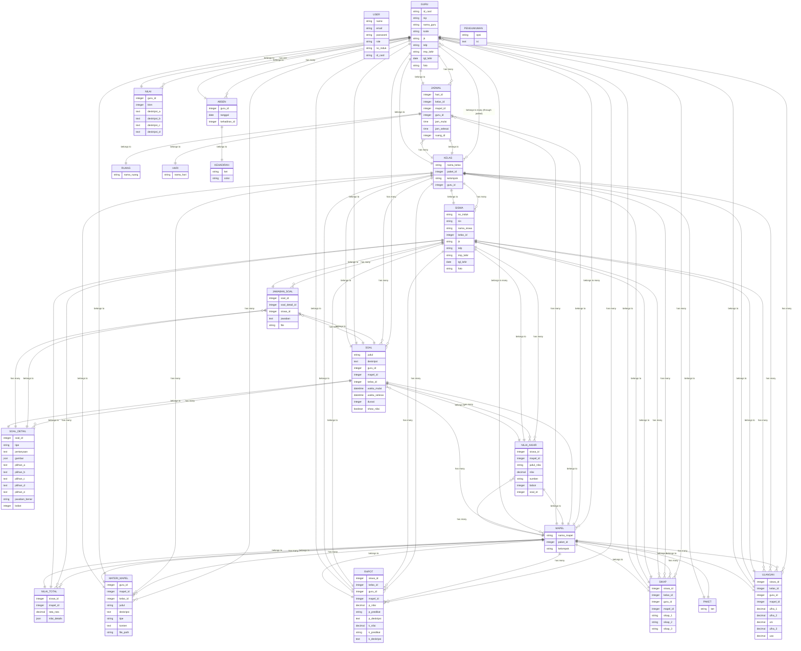

# Entity-Relationship Diagram (ERD) untuk Sistem Informasi Akademik Sekolah Laravel

Berikut adalah ERD untuk database aplikasi Sistem Informasi Akademik Sekolah yang dibangun dengan Laravel. Diagram ini menggunakan sintaks Mermaid untuk representasi visual.

## Penjelasan ERD

### Entitas Utama:

- **USER**: Tabel untuk autentikasi pengguna (guru, siswa, admin)
- **GURU**: Data guru pengajar
- **MAPEL**: Mata pelajaran
- **KELAS**: Kelas siswa
- **SISWA**: Data siswa
- **JADWAL**: Jadwal pelajaran
- **SOAL**: Soal ujian/latihan
- **SOAL_DETAIL**: Detail pertanyaan dalam soal
- **JAWABAN_SOAL**: Jawaban siswa untuk soal
- **NILAI_TOTAL**: Total nilai siswa per mapel
- **NILAI_AKHIR**: Nilai akhir siswa
- **NILAI**: Kriteria nilai (KKM, deskripsi)
- **MATERI_MAPEL**: Materi pembelajaran
- **PAKET**: Paket kurikulum
- **PENGUMUMAN**: Pengumuman sistem
- **RAPOT**: Raport siswa
- **RUANG**: Ruangan kelas
- **SIKAP**: Penilaian sikap siswa
- **ULANGAN**: Nilai ulangan siswa
- **HARI**: Hari dalam seminggu
- **KEHADIRAN**: Status kehadiran
- **ABSEN**: Absensi guru

### Hubungan Utama:

- Guru mengajar banyak mapel dan kelas
- Mapel diajarkan oleh banyak guru dan memiliki banyak jadwal
- Kelas memiliki banyak siswa dan jadwal
- Siswa termasuk dalam satu kelas dan memiliki banyak nilai
- Soal terdiri dari banyak detail pertanyaan
- Siswa menjawab soal dan mendapatkan nilai

Diagram ini dapat divisualisasikan menggunakan Mermaid di editor yang mendukungnya, seperti GitHub, VSCode dengan ekstensi Mermaid, atau online tools seperti mermaid.live.
