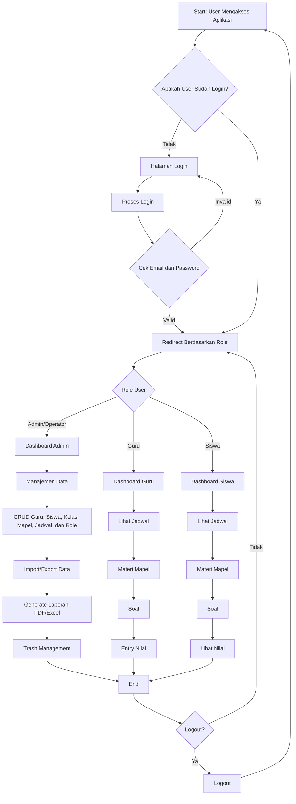

# Flowchart Sistem Informasi Akademik Sekolah (Laravel)

Berikut adalah flowchart utama dari aplikasi Sistem Informasi Akademik Sekolah berbasis Laravel. Flowchart ini menggunakan sintaks Mermaid untuk visualisasi.

## Penjelasan Flowchart:

1. **Start**: User mengakses aplikasi.
2. **Login Check**: Jika belum login, ke halaman login.
3. **Login Process**: Validasi email dan password.
4. **Role Check**: Berdasarkan role (Admin, Guru, Siswa), redirect ke dashboard masing-masing.
5. **Admin Functions**: Manajemen data lengkap, import/export, laporan, trash management.
6. **Guru Functions**: Absensi, materi, soal, nilai, rapot.
7. **Siswa Functions**: Lihat jadwal, materi, soal, nilai, rapot.
8. **End/Loop**: User bisa logout atau kembali ke dashboard.

Untuk melihat flowchart secara visual, salin kode Mermaid di atas ke editor online seperti https://mermaid.live/ atau https://mermaid-js.github.io/mermaid-live-editor/.
